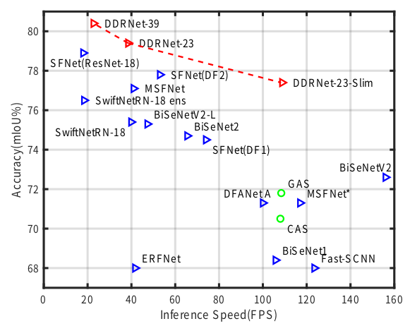

# Deep Dual-resolution Networks for Real-time and Accurate Semantic Segmentation of Road Scenes

## Introduction
This is the unofficial code of [Deep Dual-resolution Networks for Real-time and Accurate Semantic Segmentation of Road Scenes](https://arxiv.org/pdf/2101.06085.pdf). which achieve state-of-the-art trade-off between accuracy and speed on cityscapes and camvid, without using inference acceleration and extra data!on single 2080Ti GPU, DDRNet-23-slim yields 77.4% mIoU at 109 FPS on Cityscapes test set and 74.4% mIoU at 230 FPS on CamVid test set.

The code mainly borrows from [HRNet-Semantic-Segmentation OCR](https://github.com/HRNet/HRNet-Semantic-Segmentation/tree/HRNet-OCR) and [the official repository](https://github.com/ydhongHIT/DDRNet), thanks for their work.


<!--  -->
<figure>
  <text-align: center;>
  <center>
  
  </center>
</figcaption>
</figure>

## requirements
Here I list the software and hardware used in my experiment
- pytorch==1.7.0
- 3080*2
- cuda==11.1

## Quick start

### 0. Data preparation

You need to download the [Cityscapes](https://www.cityscapes-dataset.com/)datasets. and rename the folder `cityscapes`, then put the data under `data` folder. 
```
└── data
  ├── cityscapes
  └── list
```

### 1. Pretrained model

download the pretrained model on imagenet or the segmentation model from the [official](https://github.com/ydhongHIT/DDRNet)，and put the files in `${PROJECT}/pretrained_models` folder


## VAL

use the [official pretrained model](https://github.com/ydhongHIT/DDRNet) and our `eval.py` code. with [ydhongHIT's](https://github.com/ydhongHIT) advice now can reach the same accuracy in the paper. Thanks.

```python
cd ${PROJECT}
python tools/eval.py --cfg experiments/cityscapes/ddrnet23_slim.yaml
```

| model | Train Set | Test Set | OHEM | Multi-scale| Flip | mIoU | Link |
| :--: | :--: | :--: | :--: | :--: | :--: | :--: | :--: |
| DDRNet23_slim | unknown | eval | Yes | No | No | 77.83 | [official](https://github.com/ydhongHIT/DDRNet) |
| DDRNet23_slim | unknown | eval | Yes | No | Yes| 78.42 | [official](https://github.com/ydhongHIT/DDRNet) |
| DDRNet23      | unknown | eval | Yes | No | No | 79.51 | [official](https://github.com/ydhongHIT/DDRNet) |
| DDRNet23      | unknown | eval | Yes | No | Yes| 79.98 | [official](https://github.com/ydhongHIT/DDRNet) |


**Note**
- with the `ALIGN_CORNERS: false` in `***.yaml` will reach higher accuracy.


## TRAIN

download [the imagenet pretrained model](https://github.com/ydhongHIT/DDRNet), and then train the model with 2 nvidia-3080

```python
cd ${PROJECT}
python -m torch.distributed.launch --nproc_per_node=2 tools/train.py --cfg experiments/cityscapes/ddrnet23_slim.yaml
```

**the own trained model coming soon**

## OWN model
| model | Train Set | Test Set | OHEM | Multi-scale| Flip | mIoU | Link |
| :--: | :--: | :--: | :--: | :--: | :--: | :--: | :--: |
| DDRNet23_slim | train | eval | Yes | No | Yes | 77.77 | [Baidu/password:it2s](https://pan.baidu.com/s/17pOOTc-HBG6TNf4k_cn4VA) |
| DDRNet23_slim | train | eval | Yes | Yes| Yes | 79.57 | [Baidu/password:it2s](https://pan.baidu.com/s/17pOOTc-HBG6TNf4k_cn4VA) |
| DDRNet23      | train | eval | Yes | No | Yes | ~ | None |
| DDRNet39      | train | eval | Yes | No | Yes | ~ | None |

**Note**
- set the `ALIGN_CORNERS: true` in `***.yaml`, because i use the default setting in [HRNet-Semantic-Segmentation OCR](https://github.com/HRNet/HRNet-Semantic-Segmentation/tree/HRNet-OCR).
- Multi-scale with scales: 0.5,0.75,1.0,1.25,1.5,1.75. it runs too slow.
- from [ydhongHIT](https://github.com/ydhongHIT), can change the `align_corners=True` with better performance, the default option is `False`

## Reference
[1] [HRNet-Semantic-Segmentation OCR branch](https://github.com/HRNet/HRNet-Semantic-Segmentation/tree/HRNet-OCR) 

[2] [the official repository](https://github.com/ydhongHIT/DDRNet)

